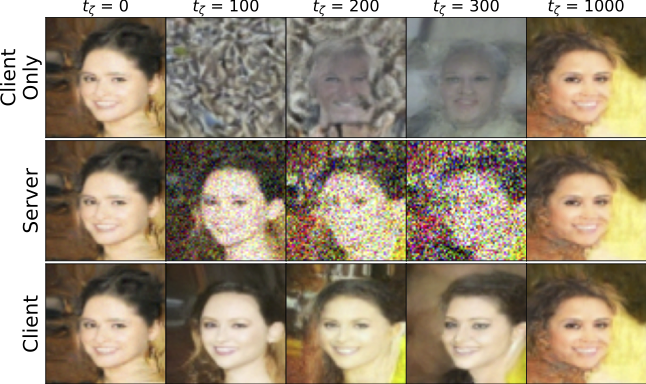

# Distributed Collaborative Diffusion Models for Synthetic Image Generation



## Abstract

In the rapidly evolving landscape of generative artificial intelligence, diffusion-based models have emerged as a compelling approach for the generation of synthetic images. However, leveraging diffusion models entails several challenges, including issues related to data availability, computational requirements, and privacy concerns. Traditional methodologies, such as federated learning, often impose significant computational demands on individual clients, particularly those with limited resources. Addressing these challenges, our research introduces a novel framework for the distributed collaborative training of diffusion models inspired by split learning. This approach significantly reduces the computational load on clients during the image synthesis process by keeping data and less computationally intensive operations local, while offloading heavier tasks to shared server resources. Our experiments with the CelebA and Caltech-UCSD Birds datasets demonstrate the potential of our approach in enhancing privacy and reducing the need to share sensitive information. This work represents a significant step forward in distributed machine learning, offering valuable insights for the development of edge computing solutions and collaborative diffusion models.

## Getting Started

### Prerequisites

- Python 3.10 or newer
- Virtual environment tool (e.g., venv, virtualenv)

### Setup

1. Clone the repository to your local machine:

   ```bash
   git clone https://anonymous.4open.science/r/collafuse-83C7/
   cd collafuse
   ```

2. Create a virtual environment and activate it:

   ```bash
   python3 -m venv .venv
   source .venv/bin/activate
   ```

3. Install the required dependencies:

   ```bash
   pip install -r requirements.txt
   ```

### Data Preparation

Download the [CelebA](https://www.kaggle.com/datasets/jessicali9530/celeba-dataset/download?datasetVersionNumber=2) dataset and save it in your data directory `<data_dir>`. The dataset can be obtained from the official source. Please ensure you comply with the dataset's usage policy.

### Running the Model

Prior to start collaborative training, adjust the `results_folder` in `./configs/config_diffusion_trainer`. Now, you can use the following command, replacing `<data_dir>` with the path to your data directory:

```bash
.venv/bin/python3 ./src/components/main.py --path_tmp_dir <data_dir>
```

### Configuration

- To switch between training and testing modes, modify the settings in `./configs/config_diffusion_trainer`.

- Individual clients can adjust the cut point and select the dataset by editing `./configs/config_clients` and `./configs/config_clouds`.

## License

This project is licensed under the MIT License - see the LICENSE file for details.
